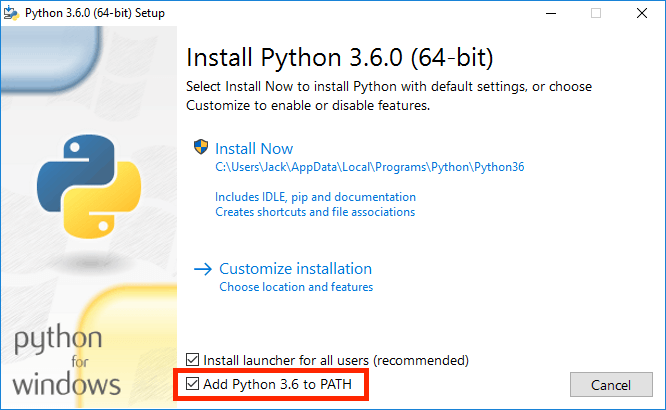

# 实验 0：环境搭建

本次实验介绍如何使用你的计算机完成课程作业，也会介绍一些 Python 的基础知识。

实验文档较长，但是大多是一些安装操作以及一些使用说明。熟练使用这些工具，可以更好地帮助你完成课程内容。

## 初始文件

下载文件 [lab00.zip](./lab00.zip)，该文件包含实验的初始代码以及用于测试的 `Ok` 工具。

## 任务一：安装 Python

Python 3 是本课程主要使用的编程语言，根据下述步骤安装 Python 3 解释器。

```{admonition} 注意
:class: attention

建议和课程保持一致，使用 Python 3.8 版本。

版本不一致可能会出现一些意想不到的报错，初学者不太容易解决。
```

对于 Windows 系统用户，可以下载 [Python 3 (the Windows x86-64 executable installer)](https://web.archive.org/web/20210118094526/https://www.python.org/ftp/python/3.8.3/python-3.8.3-amd64.exe)。双击安装包，根据提示进行安装即可。需要注意的是，安装过程中需要勾选“Add Python 3.x to PATH”选项，将 Python 添加到系统的 `PATH` 路径中：

{align=center}

对于 macOS 系统用户，可以下载 [Python 3 (64-bit)](https://web.archive.org/web/20210118094526/https://www.python.org/ftp/python/3.8.3/python-3.8.3-macosx10.9.pkg)。双击打开软件包，根据提示一步步安装就好。

## 任务二：使用终端

安装完成后，可以使用系统自带的终端工具（macOS/Linux 的“终端”或 Terminal，Windows 的 PowerShell）检查 Python 是否安装正确。

打开终端，输入 `python --version`：

{align=center}

```{admonition} 补充：环境变量
:class: note

如果你的终端无法找到 `python` 命令，很可能是环境变量 `PATH` 没有设置正确。

在 PowerShell 中可以使用 `$env:PATH` 打印出系统已存在的路径信息；macOS/Linux 终端可以使用 `echo $PATH` 命令进行打印。

至于环境变量 `PATH` 的概念以及如何设置，大家可以通过搜索引擎自行查找相关的教程。
```

如果一切安装就绪，我们就可以尝试练习使用终端，特别是一些文件管理相关的操作。

### Python 解释器

在终端输入 `python`，你将进入 Python 解释器：

```
PS C:\Users\cs100> python
Python 3.8.3 (tags/v3.8.3:6f8c832, May 13 2020, 22:37:02) [MSC v.1924 64 bit (AMD64)] on win32
Type "help", "copyright", "credits" or "license" for more information.
>>>
```

注意，某些系统可能需要你输入其他别名才可以进入，例如 `python3`，`py` 等。

你可以在 `>>>` 后面输入 Python 代码，尝试练习课程中介绍过的一些表达式。

退出解释器，可以输入 `exit()` 函数。也可以使用终端快捷键，例如 PowerShell 可以输入 `Ctrl-Z`；macOS/Linux 终端可以输入 `Ctrl-D`。

### 用户目录

打开终端时，默认情况下，你应该处在**用户目录**（home directory）或家目录，即环境变量 `HOME` 表示的路径。PowerShell 会直接显示当前的路径，例如 `PS C:\Users\cs100`。

macOS/Linux 终端会显示 `~` 符号，该符号通常可以替代 `HOME` 变量。在 macOS/Linux 终端可以输入 `echo $HOME` 显示用户目录的路径。

### 文件列表

第一个需要你掌握的命令是 `ls`，尝试在终端输入：

```
ls
```

命令 `ls` 是英文单词“list”的缩写，用于列出当前目录中的所有文件和文件夹。所谓“目录”（directory）就是文件夹的另一个别名。由于你当前正处在用户目录，执行完上述命令后，你会看到该目录包含的所有内容。

### 切换目录

可以使用 `cd` 命令切换到另一个目录，该命令是“change directory”的缩写。

首先确保你仍然处在用户目录，或者使用 `cd ~` 命令切换到用户目录。然后再尝试执行以下命令，进入桌面文件夹：

```
cd Desktop
```

尝试使用 `ls` 命令检查桌面文件夹的内容。

如果你不在用户目录，也可以尝试更快捷的操作，例如执行 `cd ~/Desktop` 可以从任何一个文件夹切换到桌面文件夹。

此时，再返回到用户目录也有多种方法，总结如下：

- 命令 `cd ..`：使用两个点 `..` 表示上一层目录（父级目录）。此时你处在桌面目录，上一层目录恰好就是用户目录。
- 命令 `cd ~`：上面介绍过 `~` 表示用户目录，所以可以使用该符号直接定位到用户目录。
- 命令 `cd`：在 macOS/Linux 终端上，直接输入该命令，默认情况下会跳转到用户目录，但是 PowerShell 不起作用。

### 新建文件夹

命令 `mkdir` 是“make directory”的缩写。尝试在桌面文件夹创建一个 `cs61a` 文件夹，用于保存课程所有作业：

```
mkdir cs61a
```

观察桌面，你会发现一个名为 `cs61a` 的文件夹。也可以通过 `ls` 命令，在终端查看该目录。

你还可以进入 `cs61a` 文件夹创建更多分类文件夹，将课程中的项目和实验分类存储：

```
cd ~/Desktop/cs61a
mkdir projects
mkdir labs
```

如果你想新建一个文件而不是目录，可以使用 `touch` 命令，例如命令 `touch test.py` 将创建 `test.py` 文件。

### 移动文件

如果你已经把 `lab00.zip` 下载到 `~\Downloads` 目录，可以使用如下命令移动该文件到我们创建的桌面项目文件夹中。

```
mv ~/Downloads/lab00.zip ~/Desktop/cs61a/labs
```

命令 `mv` 是“move”的缩写，该命令将文件 `lab00.zip` 移动到 `~/Desktop/cs61a/labs` 中。

```{admonition} 总结
:class: note

总结一下我们学习过的命令：

- `ls` 列出当前目录内容
- `cd <path to directory>` 切换到指定文件夹
- `mkdir <directory name>` 使用指定名称创建一个新的文件夹
- `touch <file name>` 使用指定名称创建一个新的文件
- `mv <source path> <destination path>` 将指定的源文件/目录，移动到指定的目标路径

以上命令都来自 Unix 操作系统，熟练使用这些命令可以更好地完成课程内容。习惯了鼠标操作，这些内容看起来可能多此一举，但是在未来的进阶课程中，这些技能将给你带来很多便利，好好练习吧！
```

## 任务三：Python 基础

### 表达式和语句

程序由表达式和语句构成。表达式（expression）是一个代码片段，但其本质是一个**值**；语句（statement）由一行或多行代码构成，在程序中执行具体的**动作**。

在 Python 解释器中输入表达式后，其值会显示在下面。当你阅读下面的示例时，可以尝试在你的 Python 解释器中输入。

在本课程中，你将会学习到多种不同的表达式和语句。但是现在，为了完成本次实验，需要你先探索一部分。

### 简单表达式

简单表达式（primitive expression）只需要一步就可以完成计算，例如数字和布尔值，这些表达式的值就是其本身：

```python
>>> 3
3
>>> 12.5
12.5
>>> True
True
```

### 算术表达式

数字可以和算术运算符进行组合，从而构成更复杂的表达式。

对于算术运算符，除了加法 `+`（addition），减法 `-`（subtraction），乘法 `*`（multiplication），求幂 `**`（exponentiation），还有三种不同的除法运算符需要牢记：

- 浮点除法 `/`（floating point division）：用第二个数字除第一个数字，得到的结果带有小数点（即使在均分的情况下，也是如此）。
- 取整 `//`（floor division）：用第二个数字除第一个数字并向下取整，得到的结果是一个整型（integer）。
- 取余 `%`（modulo）：得到的结果是执行完除法留下的正余数。一般来说，负值相关的求余没太大意义，不建议深究。

括号（parentheses）可以用于组合子表达式，并改变计算顺序；表达式的计算顺序遵循 PEMDAS 顺序，即各运算符英文首字母缩写，P 表示 parentheses。

```python
>>> 7 / 4
1.75
>>> (2 + 6) / 4
2.0
>>> 7 // 4        # Floor division (rounding down)
1
>>> 7 % 4         # Modulus (remainder of 7 // 4)
3
```

### 赋值语句

赋值语句包含一个变量名和一个表达式。计算表达式，将值通过赋值运算符 `=` 绑定到左边的变量名，从而改变程序的状态。

```python
>>> a = (100 + 50) // 2
```

此时，如果评估变量 `a` 的值，解释器将会显示 `75`：

```python
>>> a
75
```


